  

  <a href="https://shahdadk.com"><b>Website</b></a>
  &nbsp;&nbsp;·&nbsp;&nbsp;
  <a href="https://swiftsign.ca"><b>SwiftSign</b></a>
  &nbsp;&nbsp;·&nbsp;&nbsp;
  <a href="https://www.linkedin.com/in/shahdadk"><b>LinkedIn</b></a>

 

Founder and engineer in Waterloo. I take products from idea to production by myself — native iOS, full-stack web, and the AI systems that run them. Short loops, real users, things that ship.

### What I'm building

**[SwiftSign](https://github.com/shahdadk/swiftsign)** &nbsp;—&nbsp; e-signing built for developers
A Next.js and Prisma platform with JavaScript and Python SDKs and a built-in MCP server, so software can prepare, send, and sign documents on its own. Live at **[swiftsign.ca](https://swiftsign.ca)**.

### Also shipped

- **15+ native iOS apps** &nbsp;—&nbsp; Swift and SwiftUI, from health tools to everyday utilities
- **Full-stack web** &nbsp;—&nbsp; TypeScript, Next.js, Firebase, AWS, from landing pages to live products
- **AI systems** &nbsp;—&nbsp; MCP servers, Claude-powered automation, and workflows that do real work

### Stack

  
  
  
  
  
  
  
  

building & biking · Waterloo, ON
